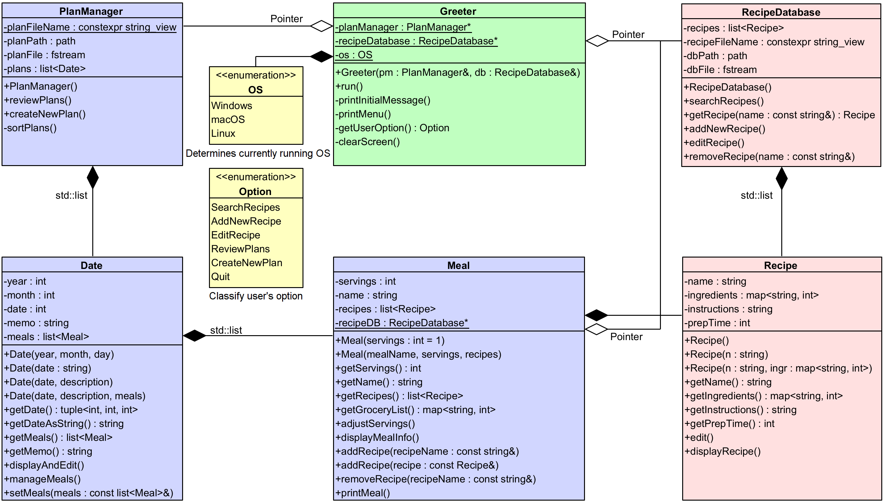

# [CAU] Software Project (JAVA)

<table>
  <tr>
    <th colspan="4">&lt;객체지향 프로그래밍> 과목 정보</th>
  </tr>
  <tr>
    <td><b>개설대학</b></td><td>소프트웨어대학</td>
    <td><b>개설학과</b></td><td>소프트웨어학부</td>
  </tr>
  <tr>
    <td><b>대상학년</b></td><td>2학년</td>
    <td><b>이수구분</b></td><td>전공선택</td>
  </tr>
  <tr>
    <td><b>과목유형</b></td><td>이론강의</td>
    <td><b>영어강의</b></td><td>영어 A</td>
  </tr>
  <tr>
    <td><b>이수학점</b></td><td>3학점</td>
    <td><b>강의시간</b></td><td>3시간</td>
  </tr>
  <tr>
    <th colspan="4">공학교육인증 교과목 정보</th>
  </tr>
  <tr>
    <td><b>공학인증</b></td><td>공학주제</td>
    <td><b>설계학점</b></td><td>2학점</td>
  </tr>
  <tr>
    <th colspan="4">이수 내역</th>
  </tr>
  <tr>
    <td><b>이수학기</b></td><td>-</td>
    <td><b>취득평점</b></td><td>-</td>
  </tr>
</table>

## IIKH (Interactive Intelligent Kitchen Helper)

### Directory Structures

```
- .vscode : settings for Visual Studio Code
- assets : assets directory (i.e. class diagram)
- bin : .o files directory
- data : data directory for iikh program
- include : header files are located
- src : source files are located

.gitignore : used for git
Makefile : used for GNU Make
OOP-Team1-Demo.mp4 : Demo video
OOP03-Team1-Report.pdf : Report
```

### Class Diagram

- Date
- Greeter
- Meal
- PlanManager
- RecipeDatabase
- Recipe